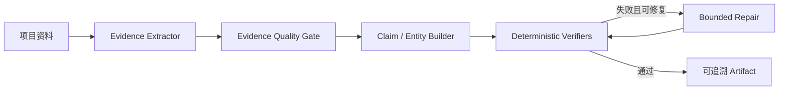

# WorkPilot

证据驱动、可验证、具备可靠执行基础的项目分析 Agent。

WorkPilot 从会议纪要、Issue 和项目文档中提取原文证据，生成周报、风险与行动项。系统不会直接相信模型输出：每条结论必须引用可定位的 Evidence，并通过确定性验证；证据不足时宁可输出 `unknown` 或让 Run 失败，也不编造答案。

> 当前定位：面向校招展示的 production-oriented prototype。可信度内核、执行账本、Checkpoint 和 Run fencing 已完成；自动恢复入口、鉴权、多租户、可靠任务队列和生产监控仍属于未来演进。

## 为什么它不是普通 LLM Demo

| 普通“AI 周报”Demo | WorkPilot |
|---|---|
| Prompt 输入，文本输出 | Evidence → Claim → Verifier → Repair → Artifact |
| 模型说什么就展示什么 | 引用、结论、实体字段分别执行确定性验证 |
| 出错后整条重跑 | 持久化执行账本，并在已提交步骤后保存 Checkpoint |
| 多个 Worker 可能覆盖状态 | PostgreSQL lease + 单调 fencing token 阻止旧 Worker 写入 |
| 只看最终文本 | Trace、预算、验证报告和 Golden/Bad Case 可回归 |

项目最重要的设计原则只有一句：

> 每条结论都必须能回到原文；无法证明的内容不进入正式产物。

## 三分钟离线演示

要求 Python 3.11+。演示使用确定性 Stub 和仓库内脱敏 Fixture，不需要任何 API Key。

```bash
python -m pip install -e ".[dev]"
python scripts/demo.py
```

脚本会创建独立的 `runs/campus-demo-*` 目录、执行完整六步 Agent 流程，并验证核心 Artifact。成功输出类似：

```text
DEMO_OK
run_state=passed
evidence_count=...
verification_errors=0
trace_events=...
```

建议依次打开：

1. `weekly_report.md`：查看带 `[E-xxxx]` 引用的最终报告；
2. `evidence.json`：查看原文、来源文件和行号；
3. `verification_report.json`：查看确定性门禁结果；
4. `trace.json`：查看计划、工具、模型、预算和调度事件。

自定义演示目录与目标：

```bash
python scripts/demo.py \
  --workspace ./tests/fixtures/workspaces/rich_project \
  --goal "识别本周进展、风险与待办" \
  --output ./runs/interview-demo
```

脚本拒绝覆盖已经存在的输出目录。

## 核心链路



运行时外围提供受限 Planner、Tool Registry、三类预算、Provider 路由、Trace/Eval，以及 PostgreSQL 执行账本、版本化 Checkpoint 和 Run lease fencing。

## 值得深挖的工程点

### 1. 可信度内核

- Candidate 与正式 Evidence 分离，只有原文 quote、locator 和来源覆盖通过后才能入库；
- Citation、Claim Support、Source Coverage、Entity Field 四类验证器；
- 修订次数有上限，模型不能绕过验证器、工具白名单和预算；
- Golden Evaluation 与 17 个 Bad Case 记录真实失败，而不是只展示成功样例。

### 2. 受限 Agent Runtime

- LLM Planner 只能在已注册工具和受控 Schema 内规划，非法计划确定性降级；
- 串行 DAG 调度，明确 `failed / blocked / skipped` 传播；
- Step、Token、Time 三类预算硬控制；
- 多 Provider 路由、重试、Failover 和安全错误分类。

### 3. 可靠执行基础

- PostgreSQL 持久化 Run、PlanStep、ToolCall、Artifact/Checkpoint Metadata；
- API `Idempotency-Key` 防止重复请求创建第二个 Run；
- 六个受限工具使用版本化 JSON Checkpoint Codec，不使用 pickle；
- Checkpoint 文件原子写入，ToolCall、PlanStep、Checkpoint Metadata 与 Run sequence 同事务提交；
- 数据库时间 lease、Heartbeat 和单调 `execution_attempt` fencing 防止 split-brain；
- 真实 PostgreSQL 验证并发 claim 唯一赢家、过期接管和旧 Worker 写入隔离。

## Web 追溯界面

安装 Web 与数据库依赖：

```bash
python -m pip install -e ".[dev,web,database]"
```

持久化服务先配置 `.env` 中的 `WORKPILOT_DATABASE_URL`，再显式迁移：

```bash
alembic upgrade head
workpilot serve --workspace-root ./tests/fixtures/workspaces
```

开发前端：

```bash
cd web
npm install
npm run dev
```

报告中的 `[E-xxxx]` 可点击跳转原文并高亮对应行。服务当前没有鉴权，只允许本机开发使用；不要直接绑定公网地址。

## CLI 与评测

直接运行：

```bash
workpilot run \
  --workspace ./tests/fixtures/workspaces/basic_project \
  --goal "生成本周项目周报" \
  --provider stub \
  --output ./runs/test-run
```

离线评测：

```bash
workpilot eval \
  --suite ./evals/最小基线.json \
  --provider stub \
  --output ./runs/eval-baseline
```

Planner 控制策略评测：

```bash
workpilot planner-eval \
  --suite ./evals/Planner最小基线.json \
  --output ./runs/planner-eval-baseline
```

真实模型调用前复制 `.env.example`，只配置准备使用的 Provider Key，并执行 `workpilot doctor`。Key 不应出现在命令行、路由文件、聊天内容或 Git 提交中。

## 仓库结构

```text
src/workpilot/
  runtime/       # 状态机、预算、Checkpoint、lease guard
  persistence/   # Repository、SQLAlchemy、执行账本与 fencing
  evidence/      # Candidate 抽取、质量门禁和 Evidence Store
  analysis/      # Claim 与结构化实体
  verification/  # 四类确定性验证器
  planning/      # 受限 Planner、Tool Registry、DAG Scheduler
  providers/     # 多厂商 Adapter、路由、重试与 Failover
  evaluation/    # Golden、指标与 Bad Case 回归
  api/           # FastAPI 服务
web/             # React 可追溯报告界面
migrations/      # Alembic 版本化迁移
tests/           # 单元、集成、故障注入与 PostgreSQL 竞态测试
```

## 已验证与明确边界

当前已有 300+ 自动化测试，覆盖正确性内核、Runtime、API、Checkpoint、迁移和并发 fencing；同时保留 2026-07-21 macOS 的历史运行基线。精确结果见[当前实现状态](./docs/06-项目状态/01-当前实现状态.md)。

尚未完成：

- 启动时自动扫描并恢复过期 Run；
- Provider 外部调用去重，恢复仍可能产生 at-least-once 调用；
- 身份认证、Tenant/User/Project 隔离和租户预算；
- 可靠任务队列、取消、背压、优雅关闭和生产指标；
- Docker/Compose 交付及正式前端托管。

因此本项目展示的是“可信 AI 应用 + 可靠执行机制”，不是已经完成的企业级分布式平台。

## 推荐阅读

- [校招项目介绍](./docs/07-求职展示/01-校招项目介绍.md)
- [五分钟演示与验收](./docs/07-求职展示/02-演示与验收.md)
- [当前实现状态](./docs/06-项目状态/01-当前实现状态.md)
- [总体架构](./docs/01-项目总体设计/02-总体架构.md)
- [高可用运行实现](./docs/03-实现细节/13-高可用运行.md)
- [下一阶段路线图](./docs/02-项目开发计划/09-下一阶段改进路线图.md)
- [完整文档阅读指南](./docs/00-文档阅读指南.md)
