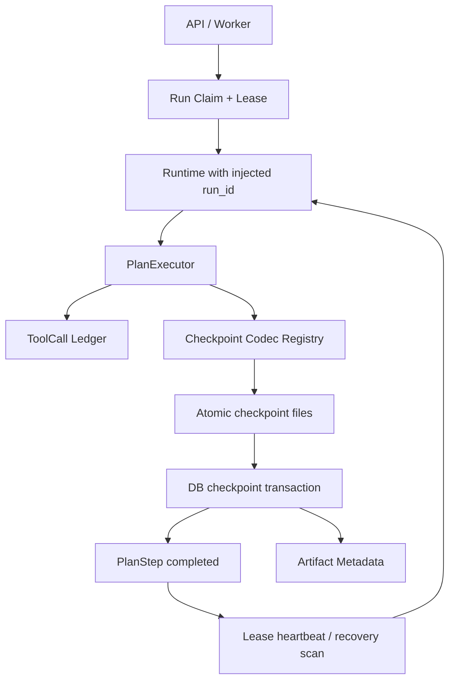

# HA-02 检查点、幂等与租约设计

## 状态

Proposed。用户未提出相反约束时，按本文推荐的 at-least-once + 幂等恢复语义实施。

## 背景与问题

HA-01 已把 API Run 身份和终态迁移到 PostgreSQL，但 Runtime 的 Plan、PlanStep、ToolCall 和中间结果仍只存在于进程内。进程在长任务中退出时，数据库只能看到一个 `running` Run，无法判断哪些步骤已完成、哪些模型调用可能已经发生，也无法安全接管。

现有实现还有一个必须先修复的身份断裂：API 创建一个 `run_id`，Runtime 构造函数又生成另一个 `run_id`。数据库、Trace、Mission Contract 和 Artifact 必须使用同一个外部注入身份，否则检查点和审计无法关联。

## 目标

- API、Runtime、Trace、Plan、ToolCall 和 Artifact 使用同一 `run_id`；
- 相同幂等请求只创建一个 Run，参数不一致时拒绝复用；
- 持久化 PlanStep、ToolCall、Artifact Metadata 和版本化 Checkpoint；
- 每个 Run 同一时刻最多只有一个有效执行者；
- 崩溃后跳过已完整提交的步骤，重新执行 running 或未提交步骤；
- 数据库、Checkpoint 文件或摘要不一致时 fail closed，不猜测成功；
- 不在本阶段引入 Celery、Kafka、Kubernetes、跨区域容灾或完整租户模型。

## 非功能要求

- **一致性**：数据库中的 completed Step 必须指向一个存在、摘要匹配且 Schema 可读取的 Checkpoint；
- **RPO**：最多丢失当前尚未提交的一个步骤；
- **RTO**：Worker 恢复扫描启动后，在一个租约 TTL 内识别可接管 Run；
- **并发**：租约获取、续约、终态提交使用数据库条件更新，不使用进程锁代替分布式互斥；
- **安全**：数据库不保存 Provider 原始响应、Evidence 正文或未脱敏输入；幂等键只保存 SHA-256 摘要；
- **可观测**：claim、renew、checkpoint commit、resume、abandon 和 conflict 都产生稳定事件或错误类型；
- **兼容性**：不配置数据库时，InMemory Adapter 仍能运行同一契约测试，但只作为显式开发模式。

## 方案比较

### 方案一：Run 行内单个 JSONB 快照

优点是实现快、读取一次完成。缺点是 Run 行成为更新热点，无法独立查询 Step/ToolCall，Schema 演进和 CAS 冲突粒度过粗，也难以审计一次具体工具调用。

### 方案二：完整事件溯源

优点是审计和重放能力最强。缺点是需要事件版本、投影器、重放规则和投影修复工具；对当前模块化单体和六步受限流程而言，运维复杂度明显超过收益。

### 方案三：规范化执行账本 + 有界 Checkpoint（采用）

PostgreSQL 保存可查询的控制面状态，版本化文件 Checkpoint 保存恢复所需的业务上下文。每次步骤提交先原子写文件，再在一个数据库事务内登记摘要并把 Step 置为 completed。数据库失败会留下可清理的孤立文件，但不会产生指向不存在文件的 completed Step。

## 高层架构



## 数据模型

### `runs` 扩展

- `idempotency_key_hash`：可空、唯一；只保存调用方幂等键摘要；
- `request_fingerprint`：workspace、goal、provider 和影响执行的配置摘要；
- `lease_owner`、`lease_expires_at`：当前执行者和租约截止时间；
- `execution_attempt`：每次成功接管递增；
- `checkpoint_seq`：最后一次已提交 Checkpoint 序号；
- 现有 `version` 用于 compare-and-swap，更新必须携带期望版本。

### `plan_steps`

复合主键为 `(run_id, step_id)`，保存 `plan_id`、工具名/版本、依赖、经过白名单过滤的输入摘要、状态、逻辑执行次数、错误类型、成功规则摘要、Checkpoint 序号、时间和版本。Plan 首次验证成功后批量创建，后续只允许系统状态机更新执行字段。

### `tool_calls`

主键为 `tool_call_id`，唯一约束覆盖 `(run_id, step_id, execution_no)`。保存稳定 `idempotency_key_hash`、工具版本、状态、物理尝试次数、安全输出摘要、Evidence ID、错误类型、开始/结束时间。原始输入和输出不入库。

### `checkpoints`

复合唯一键 `(run_id, sequence)`，保存 Schema 版本、相对文件路径、SHA-256、字节数、提交时间和关联 Step。Checkpoint Payload 包含 Plan 执行态、`StepResultStore` 可恢复输出、Evidence、ProjectSnapshot、渲染中间产物、验证摘要、修订次数和预算快照；所有字段由版本化 Codec 明确编码，不允许对任意 Python 对象做 pickle。

### `artifact_metadata`

复合唯一键 `(run_id, name, version)`，保存相对路径、SHA-256、字节数、媒体类型、状态和创建时间。路径必须重新验证位于该 Run 的 `output_dir` 下。

## 幂等协议

API 接受 `Idempotency-Key` Header。服务对 Key 做 SHA-256，对执行参数做规范化 JSON 指纹，并调用原子的 `create_or_get`：

- Key 不存在：创建 Run；
- Key 已存在且指纹相同：返回已有 Run，不启动第二个线程；
- Key 已存在但指纹不同：返回 HTTP 409；
- 未提供 Key：保持现有“每次请求创建新 Run”语义。

工具调用键由系统从 `run_id + step_id + execution_no + tool + tool_version + canonical_input_hash` 推导。崩溃重试复用同一逻辑调用键；只有显式业务修订才增加 `execution_no`。当前六个工具没有外部业务写副作用，Provider 重试可能重复计费但不会重复修改企业系统。未来写连接器只有声明并实现幂等能力后才能参与自动恢复。

## 租约与状态迁移

Worker 使用不可预测的 `lease_owner` Token 原子 claim Run。只有租约持有者可以更新执行账本、续约、提交终态或释放租约。Heartbeat 周期小于 TTL 的三分之一；续约 CAS 失败时当前执行者停止调度新步骤并把控制权交给恢复流程。

Run 恢复状态流为：

```text
pending/running --claim--> running
running + expired lease --claim--> recovering
recovering --checkpoint verified--> running
running --terminal commit--> passed/failed/cancelled
```

终态 Run 不可再次 claim。HA-02 第一版只在应用启动和显式恢复入口扫描，不以 daemon Thread 冒充可靠队列；P1 队列接入后复用同一租约协议。

## Checkpoint 提交与恢复

提交顺序：

1. Codec 生成规范化 JSON Payload；
2. 写入同目录临时文件，flush/fsync 后原子 rename；
3. 计算并验证 SHA-256 与字节数；
4. 数据库事务插入 Checkpoint/Artifact Metadata，更新 ToolCall 和 PlanStep，并递增 Run checkpoint/version；
5. 事务提交后才允许调度依赖步骤。

恢复顺序：

1. claim 过期 Run 并进入 recovering；
2. 读取最后提交的 Checkpoint，验证路径、Schema、大小、摘要和 `run_id`；
3. 重建 Plan、EvidenceStore、StepResultStore、ProjectSnapshot、渲染结果和预算；
4. completed Step 保持完成；running Step 置回 pending，并将未完成 ToolCall 标记 abandoned；
5. 使用同一逻辑幂等键重新执行未提交步骤；
6. 验证失败或 Codec 不兼容时把 Run 置为 recovery_failed，不静默整 Run 重跑。

## 失败模式

| 失败点 | 可观察结果 | 处理 |
|---|---|---|
| 文件 rename 前退出 | 只有临时文件 | 忽略并清理，不推进 Step |
| 文件完成、DB 事务前退出 | 孤立 Checkpoint | 不作为恢复依据，可对账清理 |
| DB 提交后文件损坏/丢失 | completed Step 指向无效摘要 | recovery_failed，禁止猜测跳过 |
| 租约过期但旧 Worker 仍运行 | 两个执行者竞争 | 所有写入校验 owner + version，旧 Worker 写入失败并停止 |
| 重复 API 请求参数不同 | 幂等键冲突 | HTTP 409，不复用旧 Run |
| Provider 返回后、Checkpoint 前退出 | 可能重复计费 | 同逻辑 ToolCall 标记 abandoned 后重试；记录重复风险和用量 |

## 分阶段实施

1. **HA-02A 执行账本**：统一 Run 身份；新增 Schema、Repository 契约、CAS、API 幂等创建；Runtime 写入 PlanStep/ToolCall/Artifact Metadata；暂不自动恢复。
2. **HA-02B Checkpoint Codec**：实现六个受限工具的版本化 Payload、原子文件协议和恢复重建测试。
3. **HA-02C 租约接管**：claim/renew/release、Heartbeat、过期接管和双 Worker 故障注入。
4. **HA-02D 恢复入口**：启动扫描与显式恢复 API/CLI；验证 crash、duplicate、lease expiry 和损坏 Checkpoint。

每个阶段都必须保留现有 Evidence/Verifier/Bad Case 回归。HA-02A 完成不等于检查点恢复完成，只有 HA-02B～D 的故障注入验收全部通过后才能关闭 HA-02。

## ADR：采用规范化执行账本与版本化文件 Checkpoint

### 状态

Proposed。

### 决策

控制面状态进入 PostgreSQL 规范化表；恢复业务上下文使用 JSON、显式 Schema 版本和 SHA-256 校验的文件 Checkpoint；步骤完成与 Checkpoint Metadata 在同一数据库事务内提交。恢复语义为 at-least-once，副作用工具必须提供稳定幂等键。

### 正面影响

- Step/ToolCall 可查询、可审计、可使用行级 CAS；
- 不需要引入事件投影基础设施；
- 不把 Evidence 正文和 Provider 原始响应默认放入数据库；
- 后续任务队列和多实例 Worker 可以复用同一协议。

### 负面影响

- 文件和数据库仍需对账，不能获得单存储事务的绝对原子性；
- 六个工具需要显式 Codec 和版本迁移；
- Provider 调用在极端崩溃窗口仍可能重复计费。

### 被否决方案

- Run 行内单 JSONB：热点、查询和演进边界不合适；
- 完整事件溯源：当前规模下复杂度和运维成本过高；
- 只持久化 Step 状态不保存结果：无法重建 `StepResultStore`，会产生“看似可恢复、实际不能继续”的假能力。
