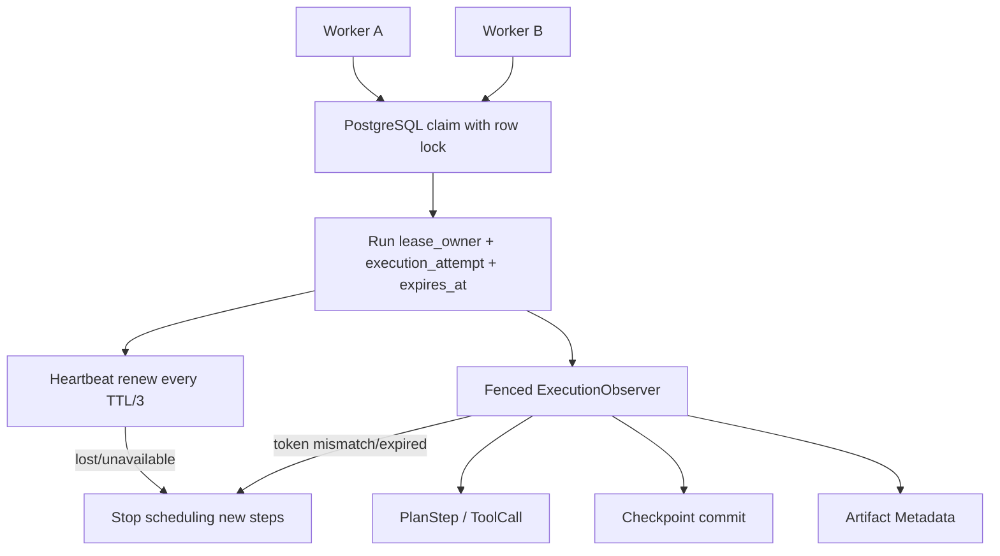

# HA-02C Run 租约与 Fencing 设计

## 状态

Implemented and accepted on 2026-07-22。真实 PostgreSQL 已验证并发 claim 唯一赢家、过期接管、旧 Worker fencing、Checkpoint/终态提交，以及带既有 Checkpoint 数据的 `0003 → 0004 → 0003 → 0004`。本文只覆盖数据库租约、Heartbeat、写入 fencing 和过期接管；Checkpoint 恢复入口与启动扫描属于 HA-02D，可靠任务队列属于 P1。

## 需求摘要

### 功能要求

- 一个 Run 同一时刻最多有一个合法执行者；
- Worker 可 claim、renew，并在提交终态时原子释放租约；
- 租约过期后另一个 Worker 可接管，`execution_attempt` 单调递增；
- 旧 Worker 即使恢复运行，也不能继续写 PlanStep、ToolCall、Checkpoint、Artifact 或 Run 终态；
- Runtime 在租约丢失后停止调度新步骤；
- InMemory 与 PostgreSQL Adapter 遵循相同契约。

### 非功能要求

- 租约判断使用数据库时间，避免 Worker 时钟偏差；
- claim/renew/终态提交使用行锁与条件校验，不依赖进程锁；
- 默认 TTL 30 秒，Heartbeat 10 秒，周期不得大于 TTL 的三分之一；
- 丢失租约后 RPO 保持为最后一个数据库已提交 Checkpoint；
- PostgreSQL 暂时不可用时 fail closed，不允许旧 Worker 猜测自己仍持有租约；
- `lease_owner` 是能力凭证，日志与 Trace 只允许记录不可逆摘要前缀；
- 不引入 Redis、Celery、Kafka、Kubernetes 或跨区域共识。

## 方案比较

### PostgreSQL 行租约 + fencing token（采用）

复用当前权威控制面。`lease_owner` 防止其他 Worker 冒用，单调递增的 `execution_attempt` 防止旧 owner token 在 ABA 场景中重新生效。每次执行写入都在相同事务中锁定 Run 并校验租约。

### PostgreSQL advisory lock

优点是互斥原语直接。缺点是锁绑定数据库连接，连接池归还、断线与恢复语义难以审计，也没有自然 TTL；不适合作为长任务业务租约。

### Redis 分布式锁

可提供成熟的 TTL 操作，但会引入第二个控制面权威和数据库/Redis 一致性问题。当前六步模块化单体没有足够收益支撑额外运维成本。

## 高层架构



## 数据模型

`runs` 新增：

- `lease_owner VARCHAR(128) NULL`：不可预测的随机 owner token；
- `lease_expires_at TIMESTAMPTZ NULL`：数据库时间定义的截止点；
- `execution_attempt INTEGER NOT NULL DEFAULT 0`：每次成功 claim 递增；
- 复合索引 `(state, lease_expires_at)`：支持 HA-02D 扫描过期 Run。

应用层 `RunLease` 包含 `run_id`、`owner_token`、`execution_attempt`、`expires_at`。该对象只在当前 Worker 内存中传递，不进入 Artifact 或普通 Trace。

## 状态机

```text
pending --claim--> running (attempt + 1)
running/recovering + unexpired lease --claim--> conflict
running/recovering + expired/no lease --claim--> recovering (attempt + 1)
running/recovering --renew by current token--> same state, extend expiry
running/recovering --terminal commit by current token--> passed/failed/cancelled, clear lease
terminal --claim/renew--> rejected
```

HA-02C 允许 claim 过期 Run 并将其置为 `recovering`，但不自动加载 Checkpoint 或继续执行。HA-02D 必须先验证并重建 Checkpoint，再把恢复流程推进到执行阶段。

## Fencing 规则

Repository 中所有执行写操作增加可选 `lease` 参数。未 claim 的开发态 Run 保持现有兼容行为；只要 `lease_owner` 非空，以下操作必须提供匹配的 `(owner_token, execution_attempt)`，且 `lease_expires_at > database_now`：

- `update_state` 与终态提交；
- PlanStep 批量创建和状态更新；
- ToolCall start/complete/fail；
- Checkpoint + ToolCall + PlanStep + Run sequence 提交；
- Artifact Metadata 写入。

校验必须和业务更新位于同一事务。PostgreSQL 统一先锁 Run，再锁 PlanStep/ToolCall，降低交叉锁顺序导致的死锁风险。只校验 owner 而不校验 attempt 不安全：旧 token 可能在 owner 名字复用时发生 ABA；二者必须同时匹配。

## Heartbeat

`LeaseHeartbeat` 使用单独守护线程和可停止 Event，每 `heartbeat_seconds` 调用一次 `renew`。构造时要求：

- TTL > 0；
- heartbeat > 0；
- heartbeat <= TTL / 3。

任一续约出现 `LeaseLostError` 或 `RepositoryUnavailableError`，Heartbeat 保存稳定错误。Runtime 在计划步骤开始前、工具返回后和 Checkpoint 提交前调用 `assert_execution_allowed()`；Repository 写入仍作为最终权威 fence。

Heartbeat 不强杀正在阻塞的 Provider SDK 调用，因为 Python 线程无法安全中止外部调用。租约丢失后该调用可能继续消耗时间或 Token，但其结果无法提交；未来 Provider cancellation 和可靠任务队列解决资源浪费。

## 错误模型与可观测性

- `LeaseConflictError`：另一个未过期 owner 已持有租约；
- `LeaseLostError`：owner/attempt 不匹配、租约已过期或 Run 已终态；
- `InvalidLeaseConfigurationError`：TTL/Heartbeat 配置非法。

Trace 事件只记录 `run_id`、`execution_attempt`、`lease_owner_hash_prefix`、新 expiry、事件类型和稳定错误类型，不记录 owner token。事件包括 `lease_claimed`、`lease_renewed`、`lease_lost`、`lease_terminal_committed`。

## 失败模式

| 失败 | 结果 | 处理 |
|---|---|---|
| 两个 Worker 同时 claim pending Run | 行锁串行化 | 一个成功，一个 conflict |
| Worker 停止 Heartbeat | lease 到期 | 新 Worker 可 claim 为 recovering |
| 旧 Worker 在新 claim 后返回 | attempt 不匹配 | 所有写入 `LeaseLostError` |
| 数据库短暂不可用 | 无法证明所有权 | Heartbeat 标记 lost，Runtime fail closed |
| renew 响应丢失但 DB 已提交 | Worker 可能保守停止 | 后续恢复流程接管，禁止猜测继续 |
| terminal commit 与 takeover 竞争 | Run 行锁串行化 | 只有先取得有效 fence 的事务成功 |

## ADR-HA02C：使用 PostgreSQL 行租约与单调 Fencing Token

### 状态

Accepted。

### 决策

使用 `runs` 行保存 owner、expiry 和 execution attempt；数据库时间与行锁是租约权威。所有执行写入强制校验 owner + attempt + expiry。Heartbeat 只负责尽早发现丢失，Repository fence 是最终一致性边界。

### 正面影响

- 不新增基础设施，复用现有 PostgreSQL 事务；
- 旧 Worker 无法覆盖新 Worker 状态；
- 后续 API/CLI 恢复和任务队列可复用相同协议；
- 可通过真实 PostgreSQL 双 Worker 竞争测试验证。

### 负面影响

- 每次执行写入多一次 Run 行锁/校验；
- Run 行成为单 Run 的串行化点，但当前执行本来就是串行 DAG；
- 长 Provider 调用丢租约后无法立刻中止，可能产生无法提交的额外成本；
- HA-02C 仍不提供自动恢复入口。

### 被否决方案

- Advisory lock：连接生命周期语义不适合长任务；
- Redis lock：新增双权威与运维成本；
- 只用 owner、不用 attempt：存在 ABA 风险；
- 仅由 Heartbeat 内存标志阻止执行：进程暂停/恢复时无法替代数据库 fence。
